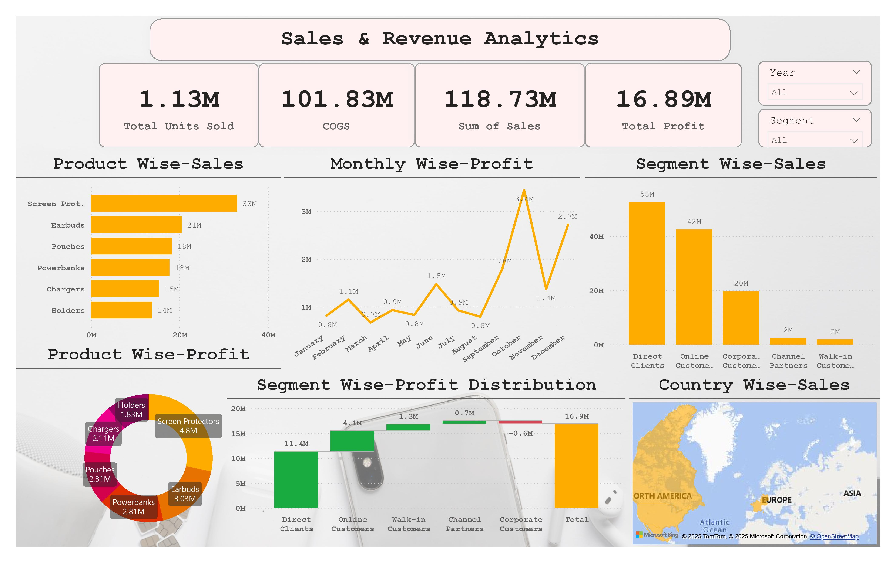

## Analytical Accounting Professional |AR/AP Management • Data Visualization & Reporting • Reconciliation | Excel • Power BI • SQL • Tableau |
5+ Years GCC Experience
[LinkedIn](https://www.linkedin.com/in/jafbinzain)
## About Me
Analytical Accounting Professional with 5+ years of GCC experience in general accounting, data analysis, reporting, reconciliations, and process optimization. Proven expertise in invoicing management, dispute resolution, and supporting month- and year-end closing processes. Skilled at delivering accurate insights to improve efficiency and support management decisions.
Experienced in Oil & Gas and Real Estate industries across the GCC market, with expertise in financial operations, dashboard development, and business performance analysis. 
Projects include logistics performance dashboards and sales/revenue analysis, focusing on trends, profitability, and market segmentation.
Well-adapted to the GCC business environment with industry expertise and a valid UAE Driving License ensuring flexibility to meet organizational needs,Keen on using data to enable quicker, smarter decisions.

## Core Competencies
• Data Analysis & Visualisation: Experienced in converting financial and operational data into insights using Excel, Power BI, Tableau to support decision-making.

• Invoicing & Accounts Receivable: Expertise in invoice processing, document verification, customer account management, overdue monitoring, and payment follow-ups via portals and email.

• Accounts Payable & Utility Bills Management: Proficient in invoice validation, reconciliation, and timely settlement of vendor and utility payments.

• Reporting & Reconciliation: Skilled in preparing sales and aging reports, reconciling accounts, and assisting with month-end and year-end closings.

## Tools & Skills
 
 

## Contact Details    
<table>
  <tbody>
    <tr>
      <td>📧</td>
      <td><a href="mailto:jafbinzain@gmail.com">jafbinzain@gmail.com</a></td>
    </tr>
    <tr>
      <td>📞</td>
      <td>(+91) 97-4691-4691</td>
