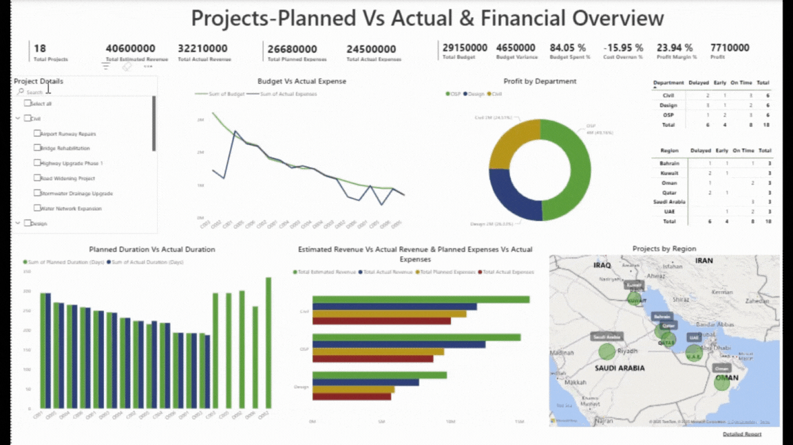
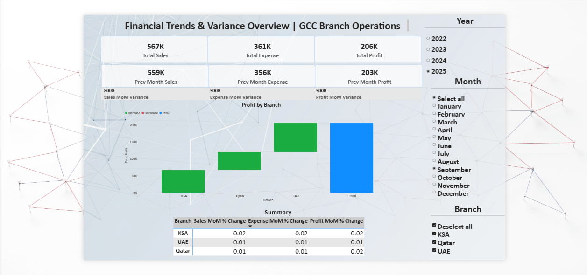
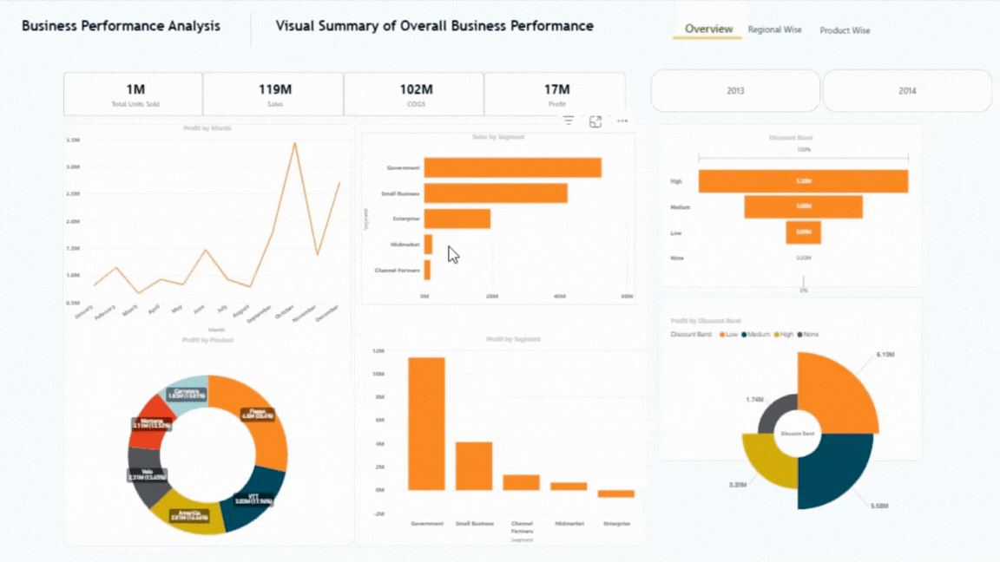
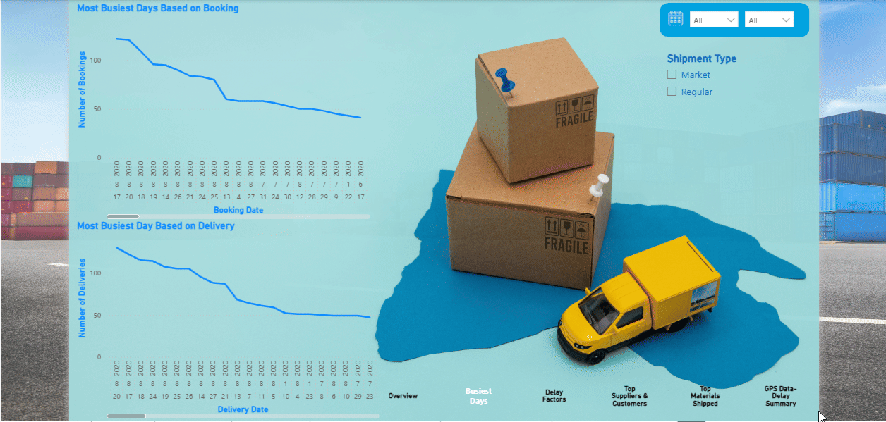

## Accounting Professional | General & Project Accounting • AR/AP • Payroll • Inventory • Data Visualization • Reporting • VAT | Excel • Power BI • Tableau 
## Transferable Iqama | KSA Driving License | 5+ Years GCC Experience
## About Me
Analytical Accounting Professional with 5+ years of GCC experience in general accounting, reporting, reconciliations, payroll, inventory and import/export operations. Skilled in AR, AP, VAT support, project-wise analysis and improving financial accuracy through efficient processes. Experienced in ERP systems, data analysis and providing clear insights to support management decisions.

[View-LinkedIn](https://www.linkedin.com/in/jafbinzain) |
[View-Professional Resume](ProfessionalResumeofMrJaferSadiq.pdf) | 
[View-Microsoft Office Specialist](MicrosoftCertification.pdf) |
[View-QuickBooks](QuickBooks.pdf) |
[View-SAP Business One](SAPTrainingCertification.pdf)
## Tools & Skills
 
 

## Portfolio
## Projects – Planned vs Actual & Financial Overview Dashboard
Estimated vs. Actual revenue | Planned vs. Actual expenses | Budget variance & Cost overrun 

## Interactive Ageing Report Dashboard
Web-published Power BI dashboard providing ageing trends, division-wise overdue insights, customer-level tracking, and invoice-level detail.
View in Web ➜[Web Dashboard](https://tinyurl.com/4avwp36k)

## Performance Trends: Month-over-Month Analysis
Month-on-Month variance tracking | Branch-level profitability

## Business Performance Analysis Dashboard
Analyse performance trends — by month, product, segment, and discount band

## Trends Over Time-Logistics:Bookings & Delivery 

## Sales & Revenue Analytics Dashboard
Highlights key business insights, including-COGS, Revenue & Sales Trends | Monthly profit trends | Product-wise and Segment-wise performance | Country-wise sales with map visualization

## Core Competencies
•	Accounting & Reconciliation: Accounts Receivable, Accounts Payable, invoicing, vendor payment processing, ageing analysis, petty cash control, bank reconciliation, VAT Returns and month-end/year-end closing support.
•	Reporting & Analysis: Sales and receivables reports, stock and security deposit reports, project-wise cost, revenue analysis and presenting financial insights for management decisions.
•	Project Accounting: Actual vs estimated expenses and revenue, percentage of completion (POC), budget variance, cost overrun analysis, actual profit calculation, project delivery performance review and preparing project dashboards for financial and operational insights.
•	Inventory Management: Inventory tracking, stock reconciliation for vehicles and stores and posting manufacturing entries by configuring BOM (Bill of Materials).
•	Payroll, WPS & Overtime: Payroll preparation, overtime calculation across departments/branches and WPS/SIF file processing.
•	Import & Export Operations: Handling import/export transactions, customs portal submissions, commercial invoices, Bills of Lading, Certificates of Origin and Pro Forma invoices.    Experience coordinating major freight providers like DHL, UPS, TNT and JAS and managing shipment documentation.
## Contact Details    
<table>
  <tbody>
    <tr>
      <td>📧</td>
      <td><a href="mailto:jafbinzain@gmail.com">jafbinzain@gmail.com</a></td>
    <tr>
      <td>📞</td>
      <td> +966 53 582 3978</td>
       <tr>
      <td>📍</td>
      <td>Riyadh-Saudi Arabia(Ready to Relocate within Kingdom)</td>
       

