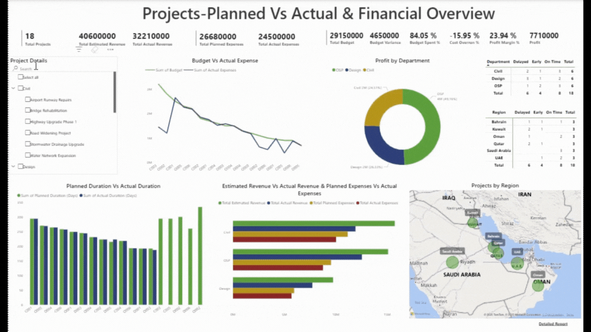
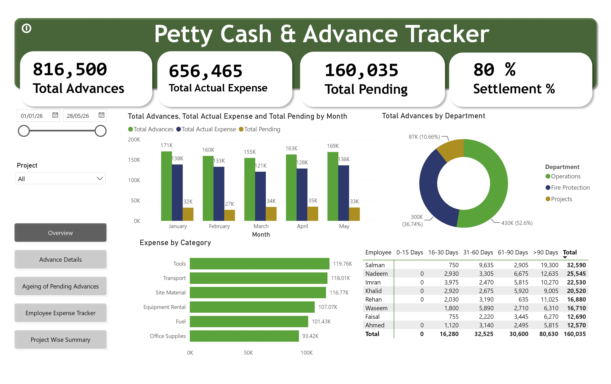
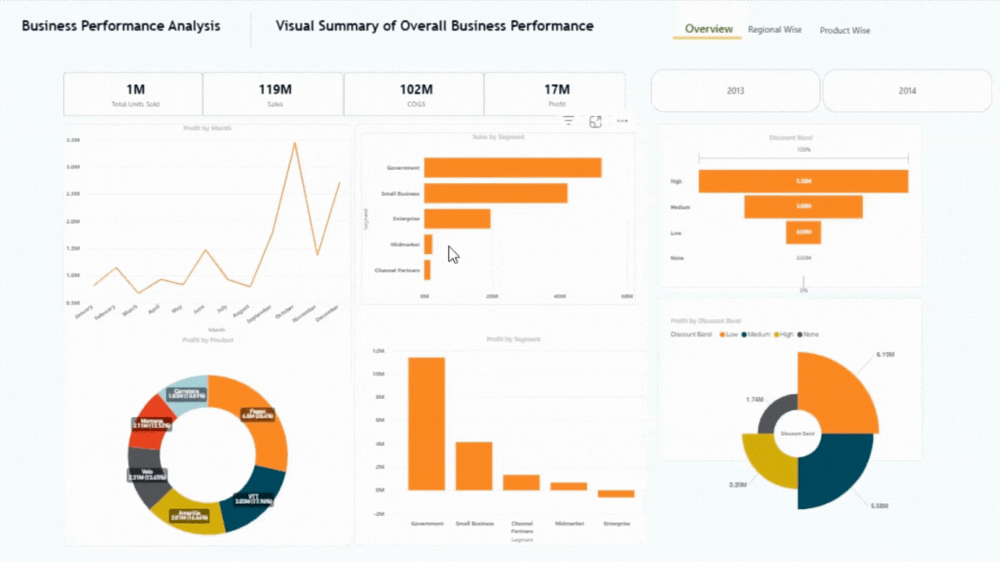
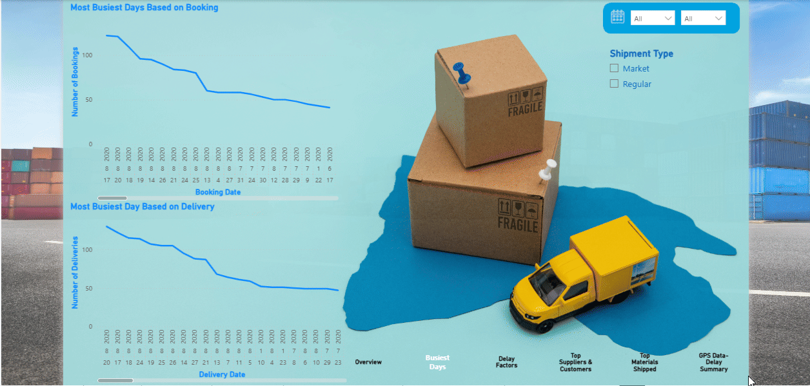

## Accounting Professional (SOCPA Eligibility Applicable ) | General & Project Accounting • AR/AP • Payroll • Inventory • Data Visualization • Reporting • VAT | Excel • Power BI • Tableau | Transferable Iqama | KSA Driving License |
## About Me
Accountant with 6+ years of GCC Experience in General Accounting, AR, AP, VAT Compliance (ZATCA), Financial Reporting, Reconciliations, Payroll, Inventory, and Import/Export Documentation. Experienced In Project-Based Invoicing, WIP Accounting, Ageing Analysis, ERP Systems, Power BI, and Excel. Involved in Month-End Closing, Reconciliations, and Preparation of Reports to assist management.

[👉LinkedIn](https://www.linkedin.com/in/jafbinzain)|
[📄Professional Resume](ProfessionalResumeofMrJaferSadiq.pdf)|
[🏆Microsoft Office Specialist](MicrosoftCertification.pdf)
[✔️QuickBooks](QuickBooks.pdf)|
[✔️SAP Business One](SAPTrainingCertification.pdf)
## Tools & Skills
 
 

## Portfolio
## Profit & Loss Analysis(MoM & YoY Variance) Dashboard
Designed an executive-ready P&L dashboard in Power BI featuring a structured layout, KPI cards, and MoM/YoY variance analysis to support quick performance comparison and detailed financial insights.
[PDF-View](ProfitLoss.pdf) [👉Power BI](https://tinyurl.com/463rd3vu)

## Projects – Planned vs Actual & Financial Overview Dashboard
Estimated vs. Actual revenue | Planned vs. Actual expenses | Budget variance & Cost overrun 

## Interactive Ageing Report Dashboard
Web-published Power BI dashboard providing ageing trends, division-wise overdue insights, customer-level tracking, and invoice-level detail.
View in Web ➜[Web Dashboard](https://tinyurl.com/4avwp36k)

## Petty Cash Monitor
Built a Power BI dashboard for petty cash and employee advance tracking, including settlement monitoring, aging analysis, and expense reporting
View in Web ➜[Web Dashboard](https://tinyurl.com/26d4s8nn) 

## Business Performance Analysis Dashboard
Analyse performance trends — by month, product, segment, and discount band

## Trends Over Time-Logistics:Bookings & Delivery 

## Sales & Revenue Analytics Dashboard
Highlights key business insights, including-COGS, Revenue & Sales Trends | Monthly profit trends | Product-wise and Segment-wise performance | Country-wise sales with map visualization

## Core Competencies

Accounting & Reconciliation: Accounts Receivable, Accounts Payable, Invoicing, Vendor Payments, Ageing Analysis, Petty Cash, Bank Reconciliation, Bank Guarantee Monitoring, VAT Returns, and Month-End Closing Support.

Reporting & Analysis: Sales and Receivable Reports, Stock and Security Deposit Reports, Bank Guarantee Reports, Project-Wise Cost and Revenue Analysis, Management Reporting.

Project Accounting: Actual Vs Budget Analysis, Estimated Vs Actual Costs and Revenue, Percentage of Completion (POC), Budget Variance, Cost Overrun Analysis, Profit Calculation, And Project Performance Dashboards.

Inventory Management: Inventory Tracking, Vehicle and Store Stock Reconciliation, BOM (Bill of Materials) Configuration and Posting Manufacturing Entries.

Payroll, WPS & Overtime: Payroll preparation, overtime calculation across departments/branches and WPS/SIF file processing.

Import & Export Operations: Import/Export Documentation, Customs Portal Submissions, Commercial Invoices, Bills of Lading, Certificates of Origin, Proforma Invoices, and Coordination with Freight Forwarders (DHL, UPS, TNT, JAS).
## Contact Details    
<table>
  <tbody>
    <tr>
      <td>📧</td>
      <td><a href="mailto:jafbinzain@gmail.com">jafbinzain@gmail.com</a></td>
    <tr>
      <td>📞</td>
      <td> +966 53 582 3978</td>
       <tr>
      <td>📍</td>
      <td>Riyadh-Saudi Arabia(Ready to Relocate within Kingdom)</td>
       

